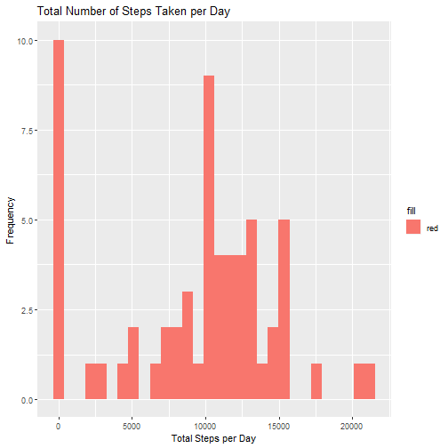
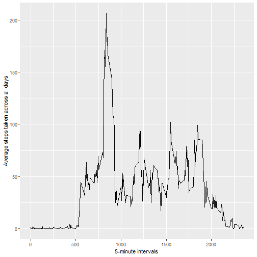
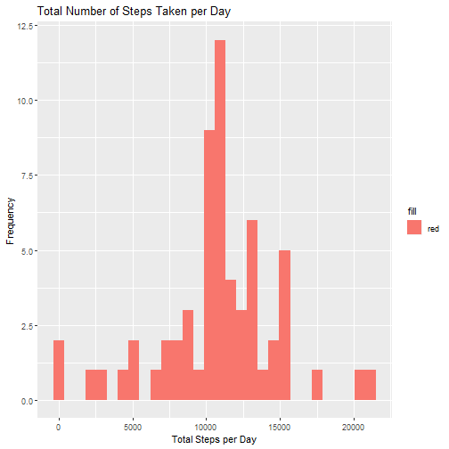
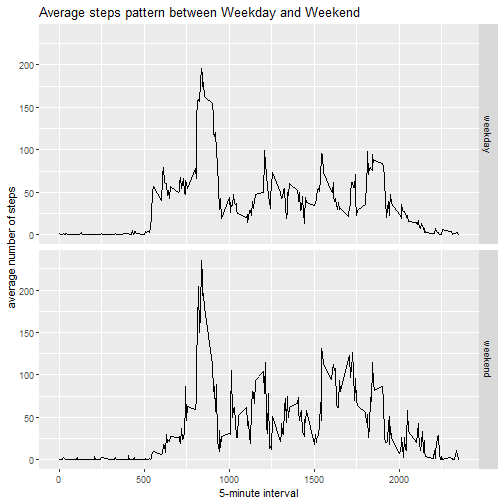

## Reproducible Research
###  Loading and preprocessing the data

```r
activity<-read.csv("activity.csv")
activity$date<-as.Date(activity$date)
str(activity)
```

```
## 'data.frame':	17568 obs. of  3 variables:
##  $ steps   : int  NA NA NA NA NA NA NA NA NA NA ...
##  $ date    : Date, format: "2012-10-01" "2012-10-01" "2012-10-01" "2012-10-01" ...
##  $ interval: int  0 5 10 15 20 25 30 35 40 45 ...
```
### What is the average daily activity pattern?


```r
library(dplyr)
library(ggplot2)
activity_byDates<-activity%>%group_by(date)%>%summarise(stepsperday = sum(steps,na.rm = TRUE))
head(activity_byDates)
```

```
## Warning: `...` is not empty.
## 
## We detected these problematic arguments:
## * `needs_dots`
## 
## These dots only exist to allow future extensions and should be empty.
## Did you misspecify an argument?
```

```
## # A tibble: 6 x 2
##   date       stepsperday
##   <date>           <int>
## 1 2012-10-01           0
## 2 2012-10-02         126
## 3 2012-10-03       11352
## 4 2012-10-04       12116
## 5 2012-10-05       13294
## 6 2012-10-06       15420
```

```r
qplot(stepsperday,data =activity_byDates,fill="red",xlab ="Total Steps per Day",ylab = "Frequency",main = "Total Number of Steps Taken per Day")
```



```r
totalstepsmean<-activity_byDates%>%summarise(mean=mean(stepsperday,na.rm = TRUE))
totalstepsmean
```

```
## Warning: `...` is not empty.
## 
## We detected these problematic arguments:
## * `needs_dots`
## 
## These dots only exist to allow future extensions and should be empty.
## Did you misspecify an argument?
```

```
## # A tibble: 1 x 1
##    mean
##   <dbl>
## 1 9354.
```

```r
totalstepsmedian<-activity_byDates%>%summarise(median=median(stepsperday,na.rm = TRUE))
totalstepsmedian
```

```
## Warning: `...` is not empty.
## 
## We detected these problematic arguments:
## * `needs_dots`
## 
## These dots only exist to allow future extensions and should be empty.
## Did you misspecify an argument?
```

```
## # A tibble: 1 x 1
##   median
##    <int>
## 1  10395
```

### What is the average daily activity pattern?


```r
averagestepsperday<-activity%>%group_by(interval)%>%summarise(averagesteps=mean(steps,na.rm = TRUE))
qplot(interval,averagesteps,data = averagestepsperday,geom="line",xlab = "5-minute intervals",ylab = "Average steps taken across all days")
```



```r
averagestepsperday[which.max(averagestepsperday$averagesteps),]
```

```
## Warning: `...` is not empty.
## 
## We detected these problematic arguments:
## * `needs_dots`
## 
## These dots only exist to allow future extensions and should be empty.
## Did you misspecify an argument?
```

```
## # A tibble: 1 x 2
##   interval averagesteps
##      <int>        <dbl>
## 1      835         206.
```

### Imputing missing values


```r
 totalna<-activity%>% summarise(missingvalues=sum(is.na(steps)))
totalna
```

```
##   missingvalues
## 1          2304
```

```r
activity_no_NA <- activity[which(!is.na(activity$steps)),]
 interval_only <- activity_no_NA %>% group_by(interval) %>% summarise(average=mean(steps))
 interval_only$average <- as.integer(interval_only$average)
 activity_na <- activity[which(is.na(activity$steps)),]
 activity_na$steps <- ifelse(activity_na$interval==interval_only$interval,interval_only$average)
 activity_impute <- rbind(activity_no_NA,activity_na)
 head(activity_impute)
```

```
##     steps       date interval
## 289     0 2012-10-02        0
## 290     0 2012-10-02        5
## 291     0 2012-10-02       10
## 292     0 2012-10-02       15
## 293     0 2012-10-02       20
## 294     0 2012-10-02       25
```

```r
 activity_impute_stepsperday<-activity_impute%>%group_by(date)%>%summarise(stepsperday=sum(steps))
 qplot(stepsperday,data =activity_impute_stepsperday,fill="red",xlab ="Total Steps per Day",ylab = "Frequency",main = "Total Number of Steps Taken per Day")
```



```r
 totalstepsmean2<-activity_impute_stepsperday%>%summarise(mean=mean(stepsperday,na.rm = TRUE))
 totalstepsmean2
```

```
## Warning: `...` is not empty.
## 
## We detected these problematic arguments:
## * `needs_dots`
## 
## These dots only exist to allow future extensions and should be empty.
## Did you misspecify an argument?
```

```
## # A tibble: 1 x 1
##     mean
##    <dbl>
## 1 10750.
```

```r
 totalstepsmedian2<-activity_impute_stepsperday%>%summarise(median=median(stepsperday,na.rm = TRUE))
 totalstepsmedian2
```

```
## Warning: `...` is not empty.
## 
## We detected these problematic arguments:
## * `needs_dots`
## 
## These dots only exist to allow future extensions and should be empty.
## Did you misspecify an argument?
```

```
## # A tibble: 1 x 1
##   median
##    <int>
## 1  10641
```

### Are there differences in activity patterns between weekdays and weekends?

```r
 activity_impute$weekend <- as.factor(ifelse(weekdays(activity$date)=="Saturday"|weekdays(activity$date)=="Sunday","weekend","weekday"))
 activity_impute$dayofweek <- as.factor(weekdays(activity$date))
 meansteps <- activity_impute %>% group_by(interval,weekend) %>%   summarise(average = mean(steps))
 qplot(interval,average,data=meansteps,geom="line",facets=weekend~.,xlab="5-minute interval",ylab="average number of steps",main="Average steps pattern between Weekday and Weekend")
```


